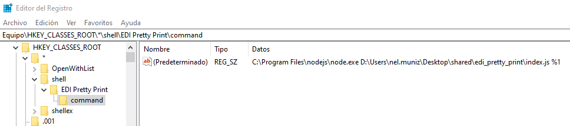
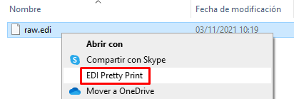
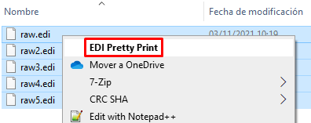

# EDI PRETTY PRINT

Pretty prints EDI files.

* From file without any carriage return, with `' as segment terminator (.\test\raw.edi)`:

```
UNB+UNOA:1+US::US+50138::THEM+140531:0305+001934++ORDERS'UNH+1+ORDERS:91:2:UN'BGM+220+A761902+4:20140530:102+9'RFF+CT:EUA01349'RFF+AAV::C'TXT+THIS IS WHAT AN EDI MESSAGE WOULD LOOK LIKE... 'NAD+BY++OUR NAME PLC::::+++++EW4 34J'CTA+PD'COM+01752 253939:TE+01752 253939:FX+0:TL'CTA+OC+:A.SURNAME'COM+2407:EX'CTA+TI+:B.BROWN'COM+0:EX'CTA+SU'COM+0161 4297476:TE+01752 670633:FX'UNT+15+1'UNZ+1+001934'
```

* To `(.\test\pretty_printed.edi)`:

```
UNB+UNOA:1+US::US+50138::THEM+140531:0305+001934++ORDERS'
UNH+1+ORDERS:91:2:UN'
BGM+220+A761902+4:20140530:102+9'
RFF+CT:EUA01349'
RFF+AAV::C'
TXT+THIS IS WHAT AN EDI MESSAGE WOULD LOOK LIKE... '
NAD+BY++OUR NAME PLC::::+++++EW4 34J'
CTA+PD'
COM+01752 253939:TE+01752 253939:FX+0:TL'
CTA+OC+:A.SURNAME'
COM+2407:EX'
CTA+TI+:B.BROWN'
COM+0:EX'
CTA+SU'
COM+0161 4297476:TE+01752 670633:FX'
UNT+15+1'
UNZ+1+001934'
```

## Install

```bash
npm install -g edi_pretty_print
```

## Uninstall

```bash
npm uninstall -g edi_pretty_print
```

## Usage

```bash
edi_pretty_print "./test/raw.edi"
```

Including the relative or absolute path inside quotes allows the tool to pretty print edi files with spaces in the filename (i.e. `npm start "./test/raw copy.edi"`).

## Windows: Install in context menu

Execute **cmd as administrator** and run the following command. It adds the needed information to the windows registry to show the tool as an option of the Windows context (right-click) menu.

```bash
edi_pretty_print_install_win
```


## Windows: Uninstall from context menu

Execute `cmd as administrator` and run the following command. It deletes the previoulsy added registry information.

```bash
edi_pretty_print_uninstall_win
```

## Windows: Execute from context menu (Right-Click)

* Launch the context menu with a right click over a single file:



* Launch the context menu with a right click over multiple selected files:

